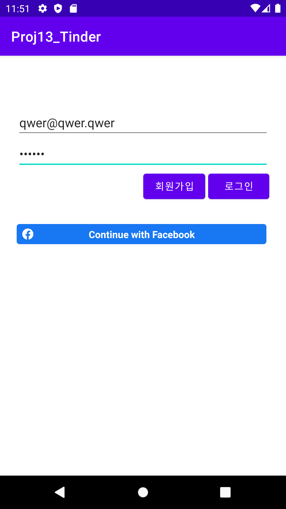
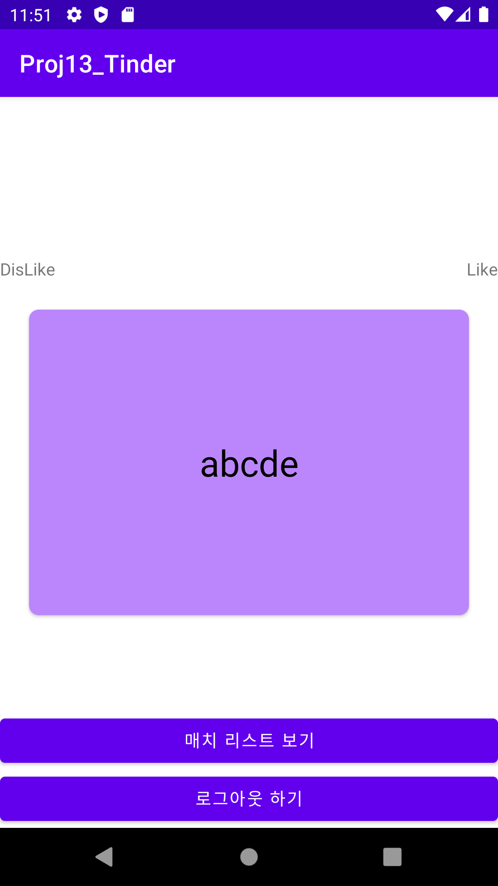

# Android Clone Coding Project #13 틴더앱
Firebase Authentication 을 통해 이메일 로그인과 페이스북 로그인을 할 수 있음
 
Firebase Realtime Database 를 이용하여 기록을 저장하고, 불러올 수 있음
 
Github에서 Opensource Library 이용

 

# 결과화면
|Screenshot1|Screenshot2|
|---|---|
|||

 

# 배운 내용 정리
- Firebase Authenetication 사용하기
  - Email Login
  - Facebook Login
- Firebase Realtime Database 사용하기
- yuyakaido/CardStackView 사용하기
